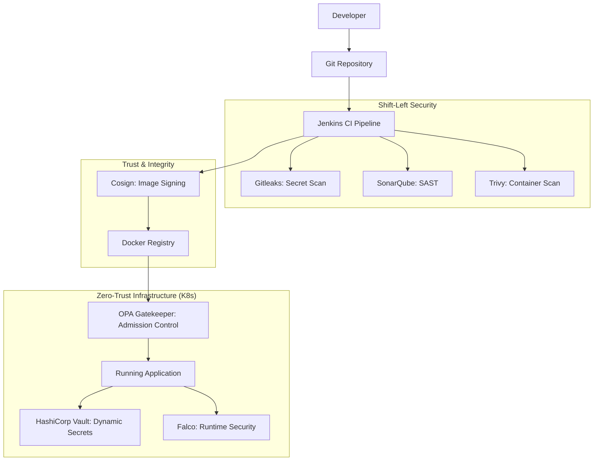

# High-Level Design (HLD): The Ironclad Pipeline

## 1. Executive Summary
"The Ironclad Pipeline" is a Zero-Trust Software Supply Chain platform designed to automate the security lifecycle of a containerized application. It ensures that only code that has been successfully scanned, tested, and verified can reach production.

## 2. Architecture Overview

### 2.1 Component Diagram

## 3. Core Principles

### 3.1 Zero-Trust Admission
Every resource request to the Kubernetes cluster is intercepted by **OPA Gatekeeper**. It enforces policies (Rego) that strictly reject any image not cryptographically signed by our secure pipeline.

### 3.2 Shift-Left Security
Security is integrated at the earliest stages:
- **Pre-Commit/Build**: Secrets are detected before they are baked into images.
- **Build-Time**: Vulnerabilities in application code and container base images are identified immediately.

### 3.3 Dynamic Secrets (No Persistent Secrets)
The application doesn't store credentials in environment variables or `.env` files. Instead, it interacts with **HashiCorp Vault** to fetch secrets at runtime, authenticated via its Kubernetes ServiceAccount.

### 3.4 Continuous Runtime Monitoring
**Falco** provides deep visibility into container processes, alerting on any anomalous behavior like shell spawns or file tampering.

## 4. User Personas
- **Developer**: Focuses on feature code; receives immediate feedback on security violations.
- **SecOps Engineer**: Defines policies (OPA/Falco) and manages vulnerabilities via central dashboards.
- **SRE**: Manages cluster health and ensures secrets are rotationally managed via Vault.
